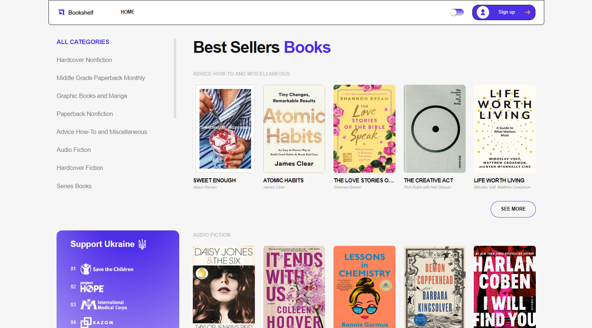

# Bookshelf

## Description
* Bookshelf is an e-commerce website with responsive/adaptive markup and UI/UX design.
* The project involves teamwork for completing various tasks, including layout and programming of the header and mobile menu, implementation of the "Support Ukraine" block, and full implementation of registration and authorization functionalities.

## Technologies
The following technologies are applied in this project:
- HTML5
- SASS
- JavaScript
- jQuery
- Slick
- REST API
- Firebase
- Responsive/Adaptive markup